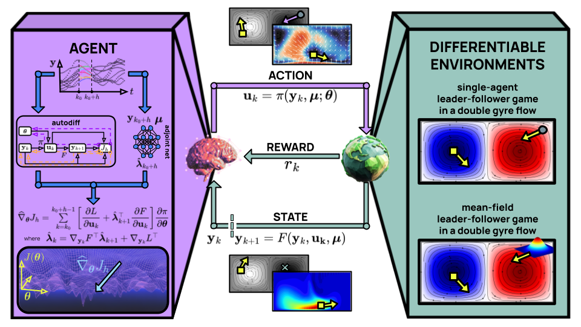

# Physics-enhanced reinforcement learning for real-time optimal control of dynamical systems

[](https://arxiv.org/abs/2607.16177)

<p align="center" width="100%">
  
  <br />
</p>

## Quickstart

The file `run.py` allows to run and reproduce all the experiments in the paper. One can simply choose the `--agent-type` and the `--experiment-type` and the code does the rest.
```bash
python run.py --agent-type={bptt, shac, pearl} --experiment-type={leaderfollower_singleagent, leaderfollower_meanfield}
```

## Getting started
The required packages are listed in  the `environment.yml` file and may be installed through the command 
```bash
conda env create -f environment.yml
```
The test cases required FEniCS to generate and handle function data. [Click here](https://fenicsproject.org/download/archive/) for installation instructions.

## Cite
If you use this code for your work, please cite
```bibtex
@misc{pearl,
      title={Physics-enhanced reinforcement learning for real-time optimal control of dynamical systems}, 
      author={Matteo Tomasetto and Nicolò Botteghi and Gabriele Bruni and Andrea Manzoni},
      year={2026},
      eprint={2607.16177},
      archivePrefix={arXiv},
      primaryClass={cs.LG},
      url={https://arxiv.org/abs/2607.16177}, 
}
